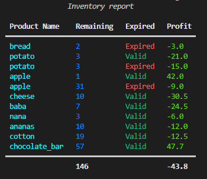

# Welcome to SuperPy!

&nbsp;
In this tutorial you'll learn how to use SuperPy from scratch.  
>If you are familiar with CLIs feel free to play around with the program to get the hang of it, you can also skip the basics, sample data has been stored in the tests/ folder of this program. 
>
>If not, stick around and you'll be using it like a pro in no time.  

&nbsp;

## The Basics  

---  

CLI stands for *command line interface*, a simple program that depends on your input.  
To use this program, before any commands you will need to write **python main.py** and then your commands.  
Make sure you are on the superpy folder wherever you chose to store this.
&nbsp;
#### Example:  
&nbsp;
>D:\Computer\Programs\superpy> python main.py -at 1  
>The new date id: 2022-12-01  
>D:\Computer\Programs\superpy>  

In our example we used a command **-at** which we'll talk about later. The line after the command happens when we press *enter* and execute it.  
For this command it returns the current system date after advancing the time, the last line is what will appear after each command.  

&nbsp;

>Your best friend when using a CLI is the **-help** or **-h** command, which will display the available commands along with their descriptions and the usage of the program.  

&nbsp;

To re-use a command you can press the *up arrow* and voilá; your command has come back and you can edit it.  

&nbsp;

>You cannot click on a part of the line to move the cursor on a CLI, you need to use your *left arrow* and *right arrow* 

&nbsp;

&nbsp;

## The first commands

---

When managing inventory, sales, and prices; you will likely want the program to be settled on the date you want these actions to take part on.  
You can of course manually import the date into the terminal when you want the action to occur in a different date than that wich the program is on. The program will default the date to the current system date, this, however, can get tiresome if you need to perform a lot of actions.  

> For this very reason the following commands were implemented:
> - -at, --advance-time
> - -st, --system-time
> - -reset, --set-time-to-current 

As you can see; the shorter of the two terms or list items is simply an abbreviation to the longer one, either of which can be used in the command line

To use **--advance-time**(*-at*), all you need to do is write by how much time you wish the date to change in the number of days, it will also accept negative numbers to go *back in time*.  

To use **--system-time**(*-st*), you only need to write down the command as it's main function is to let you know what date the system is on.

**--set-time-to-current**(*-reset*) only requires the command as well, as it will reset the system time to what the computer perceives as today.

&nbsp;

Example:  

>D:\Computer\Programs\superpy> python main.py -at 1  
>
>The new date id: 2022-12-01  
>
>D:\Computer\Programs\superpy>  python main.py -at -10
>
>The new date is:  2022-11-21
>
>D:\Computer\Programs\superpy>  python main.py -st
>
>The system is currently at 2022-11-21
>
>D:\Computer\Programs\superpy>  python main.py -reset
>
>The system is currently at 2022-12-01  

&nbsp;

**Note** If you left the day changed, don't worry about losing track, the next day the computer will ask you whether you want to keep the changed date or change back to the current date.  

&nbsp;

&nbsp;

## Importing data  

---

It is important to know that the program utilizes *csv* files to store the information, you are, however, not limited to this file type when importing information.

> The commands implemented to support the import of your own data:
> - -csv, --csv-name
> - -fn, --file-name
> - -ia, --import-action

You will need all three commands to be able to import your own data.  

&nbsp;

**--import-action**(*-ia*) will determine whether the information you give will be appended or overwritten, for this all you have to do is write 'append' or 'overwrite'.  
*append* will add the information to the existing information in the program.   
*overwrite* will delete the information on the chosen program file (don't worry, it'll create a backup) and replace it with the information you have given it.  

**--file-name**(*-fn*) is the file name or full path of the file including file name where the information you want to import is stored, if you sent that file to your SuperPy folder you don't need to type the full path, if you sent it to a folder within the SuperPy folder; make sure you include the folder name in the path, the program supports the import of:  
- csv
- json
- xlsx  
  
files, it is important that the files contain at least very similar information to the one used by our program. But we have implemented some things to make it easier.  

- Your file can contain different column headers to the ones used in the program, the program will detect this and ask you to tell it what are the equivalents of the columns needed.  
- The date format can also be different to the one we use, the program will detect this and only ask you to give it the order (yearm,month, date or other)  
- The columns can also be in a different order, once the names and name equivalents have been detected or given, the program will itself organize the information.  

**--csv-name**(*-csv*) is simply the program file that you will be importing the data to, your choices and their columns are:  
- bought.csv, id,amount,product_name,buy_date,buy_price,expiration_date
- sold.csv, sell_id,id,amount_sold,sell_date,sell_price
- prices.csv, id,price,price_date  

&nbsp;

#### Examples:

---

&nbsp;

Importing with the same format and column names:

>D:\Computer\Programs\superpy> python main.py import -ia overwrite -fn tests/test_all.xlsx -csv bought.csv  
>
>Which sheet from ['Inventory', 'purch', 'prices', 'sales'] will be imported?  
>
>Please enter a name or index,  
>
>If it is the first sheet you can simply press enter:purch  
>
>The original file will be backed up with the original name + _backup  
>
>Backup completed and saved to backup\bought_backup_2022-12-02.csv  
>
>Wipe out completed  
>
>The import has been completed  

Here we gave it all three arguments, this excel file has multiple sheets and thus the program asks close to tell it which sheet it needs to import, here we wrote *purch* but we could have just as well written *1* this because indexes start up from *0*.  
Because the date format and the column names were the same, the import simply continues, first backing up the information that was already in the program, and then replacing it with the data we gave it.

&nbsp;

---

&nbsp;

Now let's try a similar import, but with a different date format and different column names:

>D:\Computer\Programs\superpy> python main.py import -ia overwrite -fn tests/csv_inv_dif.csv -csv bought.csv
>
>From this list: ['index', 'date_of_purchase', 'quantity', 'product', 'cost', 'expiry_date'] 
>
>separated by a comma "," do not add spaces after or before the comma
>
>id can be filled in with giberish if absent: index,quantity,product,date_of_purchase,cost,expiry_date
>
>The dates on your file do not seem to have a "%Y-%m-%d" format
>
>Please establish the date format separating the order by spaces
>
>example: month day year:day month year
>
>The original file will be backed up with the original name + _backup  
>
>Backup completed and saved to backup\bought_backup_2022-12-02.csv  
>
>Wipe out completed  
>
>The import has been completed  

It is of course more work to import when the data differs, but still possible. In this example, we give it the same three commands, only the file selected does not have the same date format, or column order, or column names!  
The computer cannot figure it out by itself, so it gives you the column names of the given file, and the ones it needs, you then input the equivalents in the order of the program column names.  
Now that it knows where to look for each bit of information, the program realizes the dates are not in the format necesary to properly process the information. Trying to guess the format could lead to data corruption, so we ask you to tell it the order, from there, the program can fix up all the dates and properly import the information, and so, your data has been imported, from quite some different formats, and is ready for use.  

&nbsp;

&nbsp;

## Exporting data  

---

The export command is quite similar to the import command in its execution, this set of commands will allow you to select one of the program files and export it with the name you desire.

> The commands implemented to support the export of the program data:  
> - -csv, --csv-name
> - -fn, --file-name
> - -et, --export-type

**--csv-name** (*-csv*)  is the document that you wish to export, your choices are: 'bought.csv', 'sold.csv' and 'prices.csv'.  
**--file-name** (*-fn*) is the name you wish the file to have, this is optional and both the given and the auto-generated name a will have that date at the end of the file name,
**--export-type** (*-et*) is the extension that you wish (via exported file) to have, your choices are: 'xlsx', 'json' and 'csv'  

&nbsp;

#### Example:  
>D:\Computer\Programs\superpy> python main.py export -csv prices.csv -fn test_price_exp -et xlsx  
>      
>Exported file has been saved as saved\test_price_exp_2022-12-05.xlsx  

&nbsp;

&nbsp;

## Backing up and wiping  

---  

For this two actions you will use the argument **file** followed by: 

> - -fa, --file-action  
>
> - -csb, --csv-name 

**--file-action** (*-fa*) requires you to write either wipe or back up as this is what the program will do.  
**--csv-name** (*-csv*) is the document that you wish to perform the action on, your choices are: 'bought.csv', 'sold.csv' and 'prices.csv'  

&nbsp;

Example:
>D:\Computer\Programs\superpy> python main.py file -fa wipe -csv sold.csv
>
>The original file will be backed up with the original name + _backup
>
>Backup completed and saved to backup\sold_backup_2022-12-05.csv
>
>Wipe out completed
>
>D:\Computer\Programs\superpy>
>  

Note that the example mentions a backup, this is to prevent accidental loss of information.  
The difference between using the backup and the wipe commands, is that the backup command will leave all the information in the file, whereas the wipe command will only leave the headers.  

&nbsp;

&nbsp;

## Stocking up your inventory (buy action) 

---

>To add items to your inventory you will need to use the **buy** action followed by the commands:  
>
>- -n, --product-name
>- -a, --amount
>- -bp, --buy-price
>- -bd, --buy-date(optional)
>- -e, --expiration-date 
>- -sp, --sell-price (optional)

**--product-name** (*-n*) Is, in letters the name the product will have.  
**--amount** (*-a*) This will default to one, and otherwise it is, in numbers, the amount of products of the same name. 
**--buy-price** (*-bp*) A number, full or decimal Let represents the price the company has paid for the product.  
**--buy-date** (*-bd*) (optional) The date of purchase, which defaults to what the program perceives as today.
**--expiration-date** (*-e*) The date of product will expire, It does not obligatory as it defaultsto the year 3000, this to foresee items that do not expire.
**--sell-price** (*-sp*)  (optional)  The price the item will have, if not specified it will either grab the last price for an item with the same name or becomes 0. Not to worry as, when performing a sale, would the price still be zero it would give out a warning.

&nbsp;

#### Examples:

---

&nbsp;

Here is an example where we give it every command:

>D:\Computer\Programs\superpy> python main.py buy -n chocolate_bar -a 25 -bp 0.6 -bd 2022-11-11 -e 2027-01-01 -sp 2.7
>
>Action completed 
>  
>D:\Computer\Programs\superpy>  

In this example we have given it every term it needs, it's important to use underscores ('_') instead of spaces when naming an item.  
Now that the purchase was succesful, the inventory document will look a little like this :

>id,amount,product_name,buy_date,buy_price,expiration_date
>
>19,25,chocolate_bar,2022-11-11,0.6,2027-01-01  

And the price document, since we specified one, like this

>id,price,price_date
>
>19,2.7,2022-11-11

&nbsp;

---

&nbsp;

Here is an example where we purchase several bulks of the same item:

>D:\Computer\Programs\superpy> python main.py buy -n chocolate_bar -a 25 80 34 -bp 0.6 -e 2027-01-01 2026-12-12 2025-06-06  
>
>Action completed 
>  
>D:\Computer\Programs\superpy>  

In this example we have given it you can see there are multiple amounts, this is in case a bulk purchase has bulks with different expiration dates, which is why there are also 3 expiraiton dates

Now that the purchase was succesful, the inventory document will look a little like this :

>id,amount,product_name,buy_date,buy_price,expiration_date
>
>20,25,chocolate_bar,2022-12-08,0.6,2027-01-01
>
>21,80,chocolate_bar,2022-12-08,0.6,2026-12-12
>
>22,34,chocolate_bar,2022-12-08,0.6,2025-06-06

And the price document, since we specified one, like this

>id,price,price_date
>
>20,2.7,2022-12-08
>
>21,2.7,2022-12-08
>
>22,2.7,2022-12-08

Although we did not give it a date, the purchase defaults to the date the system is on.  
We also did not give it a saleprice, but the program searched for the last price available and set it, you can always change the price of one or more of the items later.

&nbsp;

---

&nbsp;

Here is an example where we give it the least possible commands:

>D:\Computer\Programs\superpy> python main.py buy -n paper_clip -bp 0.2
>
>Action completed 
>  
>D:\Computer\Programs\superpy>    

In this example we have given it only a name and a cost.  

>id,amount,product_name,buy_date,buy_price,expiration_date
>
>23,1,paper_clip,2022-12-08,0.2,3000-01-01  

And the price document, since we specified one, like this

>id,price,price_date
>
>23,0,2022-12-08

The saleprice was set to 0 as there were no previous prices for this item name, nor did we give it a sale price. The expiration date was set to the programs default, the firt day of the year 3000, expiration dates are not changeable throu the cli so it is recomended to only leave it out if the item cannot expire. The amount was set to 1 as a default.  

&nbsp;

&nbsp;

## Selling an item

---

>To perform sales you will need to use the sell action followed by some or all of these commands:
>
>- -n, --product_name
>- -id, --item-id
>- -d, --date
>- -a, --amount
>- -p, --price

Note that product name and item id are mutually exclusive.

**--product_name** (*-n*) The name of the product to be sold, the program will give you a list of the id's and the amount available that match the name.  
**--item-id** (*-id*) If the id is known, the id of the product to be sold.  
**--date** (*-d*) The date the sale will take place in, it defaults to what the program recognizes as today.   
**--amount** (*-a*) The amount to sell, it defaults to 1 when not given.  
**--price** (*-p*) The price of the item, if given, it will work as a price change, if not, it will search for the last price on that item.  
&nbsp;

#### Examples:

---

&nbsp;

Here we do not give it a price:

>D:\Computer\Programs\superpy> python main.py sell -n chocolate_bar  -d 2022-12-07 -a 2
>
>Sale completed for 5.4
>
>D:\Computer\Programs\superpy> 

In this exmaple, we have given it a product name, an amount and the date of the sale.
Althought there are more chocolate_bar instances in the inventory, only one was officialy in it on the given then.  
Theprogram has automatically found the last price for this item and applied it, as well as the id corresponding to it.  

The sales document would now look a bit like this: 

>sell_id,id,amount_sold,sell_date,sell_price
>
>23,19,2,2022-12-07,2.7

&nbsp;

---

&nbsp;

In this example, we will give the item a price:

>D:\Computer\Programs\superpy> python main.py sell -n chocolate_bar  -a 2 -p 4
>
>*Available  chocolate_bar items*
>
>┏━━┳━━━━━┓
>
>┃&nbsp; ID ┃ Remaining ┃
>
>┡━━╇━━━━━┩
>
>│&nbsp;&nbsp;&nbsp;19&nbsp;&nbsp;&nbsp;│&nbsp;&nbsp;&nbsp;&nbsp;&nbsp;&nbsp;&nbsp;23 &nbsp;&nbsp;&nbsp;&nbsp;&nbsp;&nbsp;&nbsp;│
>
>│&nbsp;&nbsp;&nbsp;20&nbsp;&nbsp;&nbsp;│&nbsp;&nbsp;&nbsp;&nbsp;&nbsp;&nbsp;&nbsp;25 &nbsp;&nbsp;&nbsp;&nbsp;&nbsp;&nbsp;&nbsp;│
>
>│&nbsp;&nbsp;&nbsp;21&nbsp;&nbsp;&nbsp;│&nbsp;&nbsp;&nbsp;&nbsp;&nbsp;&nbsp;&nbsp;80 &nbsp;&nbsp;&nbsp;&nbsp;&nbsp;&nbsp;&nbsp;│
>
>│&nbsp;&nbsp;&nbsp;22&nbsp;&nbsp;&nbsp;│&nbsp;&nbsp;&nbsp;&nbsp;&nbsp;&nbsp;&nbsp;34 &nbsp;&nbsp;&nbsp;&nbsp;&nbsp;&nbsp;&nbsp;│ 
>
>├───┼────────┤
>
>│&nbsp;&nbsp;&nbsp;&nbsp;&nbsp;&nbsp;&nbsp;&nbsp;│&nbsp;&nbsp;&nbsp;&nbsp;&nbsp;&nbsp;&nbsp; 162 &nbsp;&nbsp;&nbsp;&nbsp;&nbsp;&nbsp;&nbsp;│
>
>└───┴────────┘
>
>Please select the IDs followed by the amounts, separated by spaces: 22 2
>
>Should the same price be set for all 4 instances of chocolate_bar? 
>
>    yes/no: yes
>
>Sale completed for 8.0
>
>D:\Computer\Programs\superpy> 

In this example we have not given it a date, in our inventory, at the time of the sale, there are 4 different id's that match the given name, because of this, we are requested to specify which id we are selling form.  

Aditionally, as we set the new price, it wishes to know if this should be the new price for every item of the same name, if you were to answer no, the price would only be changed for the id selected.

If you were to select various id's it will ask you the price quesiton multiple times.

&nbsp;

---

&nbsp;

In this new example, we sell something that has no price yet and using the id:

>D:\Computer\Programs\superpy> python main.py sell -id 23 -a 1 
>
>The current price for this item is 0, please insert a price: 1.4
>
>Sale completed for 1.4
>
>D:\Computer\Programs\superpy> 

In this example, we sold the item using it's id, which leads to the program directly knowing which inventory item it should grab from.  
We have no price, the program notices this and allows us to set one, this new price will be registered on the price document from now on.  
If we would make a new sale with the same item, it would now know what to charge for it.

&nbsp;

---

&nbsp;

In this new example, we sell something usid the id but requesting more items than those available under said id:

>D:\Computer\Programs\superpy> python main.py sell -id 21 -a 82
>
>There are not enough items available of ID= 21
>
>The program will search for products with a matching name to the given id
>
>*Available  chocolate_bar items*
>
>┏━━┳━━━━━┓
>
>┃&nbsp; ID ┃ Remaining ┃
>
>┡━━╇━━━━━┩
>
>│&nbsp;&nbsp;&nbsp;19&nbsp;&nbsp;&nbsp;│&nbsp;&nbsp;&nbsp;&nbsp;&nbsp;&nbsp;&nbsp;22 &nbsp;&nbsp;&nbsp;&nbsp;&nbsp;&nbsp;&nbsp;│
>
>│&nbsp;&nbsp;&nbsp;20&nbsp;&nbsp;&nbsp;│&nbsp;&nbsp;&nbsp;&nbsp;&nbsp;&nbsp;&nbsp;24 &nbsp;&nbsp;&nbsp;&nbsp;&nbsp;&nbsp;&nbsp;│
>
>│&nbsp;&nbsp;&nbsp;21&nbsp;&nbsp;&nbsp;│&nbsp;&nbsp;&nbsp;&nbsp;&nbsp;&nbsp;&nbsp;80 &nbsp;&nbsp;&nbsp;&nbsp;&nbsp;&nbsp;&nbsp;│
>
>│&nbsp;&nbsp;&nbsp;22&nbsp;&nbsp;&nbsp;│&nbsp;&nbsp;&nbsp;&nbsp;&nbsp;&nbsp;&nbsp;18 &nbsp;&nbsp;&nbsp;&nbsp;&nbsp;&nbsp;&nbsp;│ 
>
>├───┼────────┤
>
>│&nbsp;&nbsp;&nbsp;&nbsp;&nbsp;&nbsp;&nbsp;&nbsp;│&nbsp;&nbsp;&nbsp;&nbsp;&nbsp;&nbsp;&nbsp; 144 &nbsp;&nbsp;&nbsp;&nbsp;&nbsp;&nbsp;&nbsp;│
>
>└───┴────────┘
>
>Please select the IDs followed by the amounts, separated by spaces: 21 80 19 2
>
>Sale completed for 320.0
>
>Sale completed for 8.0
>
>D:\Computer\Programs\superpy> 

As you can see here, although we gave it an id, we requested more items than were available, the program realizes this and gives us the option to grab items from other ids with a matching product name.

---

&nbsp;

&nbsp;

## Setting the price of an item 

---

If the price of the inventory item was not set upon purchase, or the price needs to be changed, the **price** command will do that for you.

>To change the price of an item you will need the following:
>
>- -n, --product_name
>- -id, --item-id
>- -p, --price
>- -d, --date

Note that *product_name* and *id* are mutually exclusive.  

**--product_name** (*-n*) The name of the product which is to have it's price changed, this will automatically change the price of all products with the same name.  
**--item-id** (*-id*) The id of the product to be changed, it will give the option to change the price of all items that match the product name of the id.  
**--price** (*-p*) The new price the product will have, txpressed in a whole or decimal number.  
**--date** (*-d*)  The date the price will be registered to, this has relevance regarding reports and sales. It defaults to what the program percieves as today.

&nbsp;

#### Examples:

---

&nbsp;

Setting the price without a date:  

>D:\Computer\Programs\superpy> python main.py price -id 22 -p 2.7
>
>The price for 22 has been set to 2.7
>
>D:\Computer\Programs\superpy> 

Here we provided the id we wish to change the price of, and what the new price should be.  

&nbsp;

---

&nbsp;

Setting the price *with* a date:  

>D:\Computer\Programs\superpy> python main.py price -id 22 -p 2.5 -d 2022-12-08
>
>The price for 22 has been set to 2.5
>
>D:\Computer\Programs\superpy>   

In this situation, the proce has been set to a specific date, this is relevant, as if there are other prices set on a later time, this price will not be chose when making a sale, however, if we were to register a sale on the same date we set the price to, the program would grab this as the sale price for the item.

&nbsp;

---

&nbsp;

Setting the price using the item name:

>D:\Computer\Programs\superpy> python main.py price -n chocolate_bar -p 3.4    
>
>The price for id 19 has been set to 3.4
>
>The price for id 20 has been set to 3.4
>
>The price for id 21 has been set to 3.4
>
>The price for id 22 has been set to 3.4
>
>D:\Computer\Programs\superpy>  

As you can see, you can change the price for every instance of an item by simply using it's name. The program will search for all id's that match the given name and set the new price.

&nbsp;

---

&nbsp;

&nbsp;

## Reports  

---

This section is quite a bit more complex, as it encompasses of various forms of reports to give you better insight into the information that the program can handle for you.  Because of this the instructions will be divided per report type.  

> The report types are:
>save
> - i,inventory
> - e, expired
> - p, profit
> - r, revenue
> - name
> - id

After writing reporter you will right one from the previously given list.  
There is a verbosity command, **-v** or **--verbosity**  with the level 0, 1, 2. The default is 1, but you can request a more complex report with 2 a simplified report with 0.  

Any of the reports can be saved by calling for the command **--save** and typing the file extension desired for it's save 
- xlsx
- csv
- json

&nbsp;

### i, inventory

---

> To request an inventory report you need but 2 arguments:
> 
> - A **date** (Default: today) which can be expressed as
>     - -y, --yesterday
>     - -t, --today
>     - -tw, --tomorrow
>     - -d, --date (which can be a single date or a range)
> 
> - **verbosity** (Default: 1) which can be expressed as 
>     - -v, --verbosity

The inventory and the expired reports work a little different to other reports regarding date.  
If you were to use the named dates such as *-yesterday* or *-today* or give it a single date (complete with year month and day) you would get the entire inventory up to that date.  

If you express *--date* as a year, A year and a month, or two separate dates (which can be full or just year or year-month) this report will return a full inventory of items that have been bought within the date range and also sold within the date range.  

*Verbosity* as mentioned earlier will have impact on how detailed the report is, its default value is the middle ground; **1**, **0** will simplify the reportand **2** will extend it, making it so that items that are depleted will also show up in the inventory report.  

&nbsp;

#### Examples:  

---

&nbsp;

In this example we do not choose a verbosity, and it is automatically set to 1  
>D:\Computer\Programs\superpy>   python main.py report i
>
> 
>
> D:\Computer\Programs\superpy>

&nbsp;

---

&nbsp;

>D:\Computer\Programs\superpy>   python main.py report i -v 2
>
> 
>
> D:\Computer\Programs\superpy>

&nbsp;

---

&nbsp;

>D:\Computer\Programs\superpy>   python main.py report i -v 0
>
> 
>
> D:\Computer\Programs\superpy>

&nbsp;

---

&nbsp;

In this example as well as the next one, we have chosen a date range, only the second one will represent the entire year of 2016                            
>D:\Computer\Programs\superpy>   python main.py report i -v 2 -d 2016-09-08 2022-10-02
>
> 
>
> D:\Computer\Programs\superpy>

&nbsp;

---

&nbsp;

>D:\Computer\Programs\superpy>   python main.py report i -v 2 -d 2016
>
> 
>
> D:\Computer\Programs\superpy>
          
&nbsp;

&nbsp;

### e, expired

---

The expired command is nearly identical to the inventory command, its main difference being that it will only show expired inventory. 

> To request an expired inventory report you need but 2 arguments:
> 
> - A **date** (Default: today) which can be expressed as
>     - -y, --yesterday
>     - -t, --today
>     - -tw, --tomorrow
>     - -d, --date (which can be a single date or a range)
> 
> - **verbosity** (Default: 1) which can be expressed as 
>     - -v, --verbosity

If you were to use the named dates such as *-yesterday* or *-today* or give it a single date (complete with year month and day) you would get the entire expired inventory up to that date.   

If you express *--date* as a year, A year and a month, or two separate dates (which can be full or just year or year-month) this report will return a full expired inventory of items that have been bought within the date range and also sold within the date range.   

*Verbosity* as mentioned earlier will have impact on how detailed the report is, its default value is the middle ground; **1**, **0** will simplify the report and **2** will extend it, making it so that items that are depleted will also show up in the expired inventory report.  

&nbsp;

Examples:  

---

&nbsp;

>D:\Computer\Programs\superpy>   python main.py report e -v 2 
>
> 
>
> D:\Computer\Programs\superpy>
          
&nbsp;

---

&nbsp;

>D:\Computer\Programs\superpy>   python main.py report e 
>
> 
>
> D:\Computer\Programs\superpy>
          
&nbsp;

As you can see in the examples, you can get your expired inventory report with just the *report e* commands, like all other reports, youc an choose a specifict date or date range, this will base the table on the items bought and sold within said date range.

&nbsp;

&nbsp;

### p, profit

---

The profit report will give you insight into the profit made with the sales specific to a date or date range.  

>The arguments you need to request the profit report are:
>
> - A **date** (Default: today) which can be expressed as
>     - -y, --yesterday
>     - -t, --today
>     - -tw, --tomorrow
>     - -d, --date (which can be a single date or a range)
> 
> - **verbosity** (Default: 1) which can be expressed as 
>     - -v, --verbosity

Both profit and revenue work a little different from inventory and expired regarding dates.  

If you were to use the named dates such as *-yesterday* or *-today* or give it a single date (complete with year month and day) you would get the profit for that specific day.  

If you express *--date* as a year, A year and a month, or two separate dates (which can be full or just year or year-month) this report will return the profit made specifically on sales within that range.  

*Verbosity*'s default value is the middle ground; **1**, **0** will simplify the report to a signle sentence with the total for the date or date range and **2** will extend it, including the costs made and the revenue.  
          
&nbsp;

Examples:  

---

&nbsp;

>D:\Computer\Programs\superpy>   python main.py report p -y
>
> 
>
> D:\Computer\Programs\superpy>
          
&nbsp;

---

&nbsp;

>D:\Computer\Programs\superpy>   python main.py report p -y -v 2
>
> 
>
> D:\Computer\Programs\superpy>
          
&nbsp;

---

&nbsp;

>D:\Computer\Programs\superpy> python main.py report p -y -v 0
>
>The total profit for 2022-12-08 is: 553.4
>
> D:\Computer\Programs\superpy>
          
&nbsp;

---

&nbsp;

>D:\Computer\Programs\superpy> python main.py report p -d 2022-09 2022-10
>
> 
>
> D:\Computer\Programs\superpy>
          
&nbsp;

As you can see in theese examples, profit reports can be both extensive or extremely simple, and date ranges are easy to pick, if you give it only a year or a year-month, the program will automatically create a range from the first day of the first date to the last day of the last date given.  
You can of course also request specific dates or date rangesBy simply typing in full dates.

&nbsp;

&nbsp;

### r, Revenue

---

The revenue report will give you insight into the revenue made with the sales specific to a date or date range.  

>The arguments you need to request the revenue report are:
>
> - A **date** (Default: today) which can be expressed as
>     - -y, --yesterday
>     - -t, --today
>     - -tw, --tomorrow
>     - -d, --date (which can be a single date or a range)
> 
> - **verbosity** (Default: 1) which can be expressed as 
>     - -v, --verbosity

If you were to use the named dates such as *-yesterday* or *-today* or give it a single date (complete with year month and day) you would get the revenue for that specific day.  

If you express *--date* as a year, A year and a month, or two separate dates (which can be full or just year or year-month) this report will return the revenue made specifically on sales within that range.  

*Verbosity*'s default value is the middle ground; **1**, **0** will simplify the report to a signle sentence with the total for the date or date range and **2** will extend it, including the costs made.  
          
&nbsp;

Examples:  

---

&nbsp;

>D:\Computer\Programs\superpy>   python main.py report r -y
>
> 
>
> D:\Computer\Programs\superpy>
          
&nbsp;

---

&nbsp;

>D:\Computer\Programs\superpy>   python main.py report r -y -v 2
>
> 
>
> D:\Computer\Programs\superpy>
          
&nbsp;

---

&nbsp;

>D:\Computer\Programs\superpy> python main.py report r -y -v 0
>
>The total revenue for 2022-12-08 is: 616.6
>
> D:\Computer\Programs\superpy>
          
&nbsp;

---

&nbsp;

>D:\Computer\Programs\superpy> python main.py report r -d 2022-09 2022-10
>
> 
>
> D:\Computer\Programs\superpy>
          
&nbsp;

As you can see in theese examples, revenue reports can be both extensive or extremely simple, and date ranges are easy to pick, if you give it only a year or a year-month, the program will automatically create a range from the first day of the first date to the last day of the last date given.  
You can of course also request specific dates or date rangesBy simply typing in full dates.

          
&nbsp;

&nbsp;

### name

---

>The arguments you need to request the item report are:
>
> - A **date** (Default: today) which can be expressed as
>     - -y, --yesterday
>     - -t, --today
>     - -tw, --tomorrow
>     - -d, --date (which can be a single date or a range)
> 
> - **verbosity** (Default: 1) which can be expressed as 
>     - -v, --verbosity
>
> - The **desired product**, expressed as a name with the command:
>   - -n, --product_name

#### Examples:

&nbsp;

---

&nbsp;

>D:\Computer\Programs\superpy> python main.py report name -n chocolate_bar -d 2022-11-11
>
> 
>
> D:\Computer\Programs\superpy>

As you can see, it includes only the cocolate bar items that existed before the selected date.  

&nbsp;

---

&nbsp;

>D:\Computer\Programs\superpy> python main.py report name -n chocolate_bar -v0
>
> 
>
> D:\Computer\Programs\superpy>

&nbsp;

---

&nbsp;

>D:\Computer\Programs\superpy> python main.py report name -n chocolate_bar -v 2
>
> 
>
> 
>
> D:\Computer\Programs\superpy>

This one is a bit more complex, this elaborate report will give you a separate table for each id that matches the given name and at the end, a summary of the totals (or average for price)  

&nbsp;

&nbsp;

### id

---

>The arguments you need to request the item report are:
>
> - A **date** (Default: today) which can be expressed as
>     - -y, --yesterday
>     - -t, --today
>     - -tw, --tomorrow
>     - -d, --date (which can be a single date or a range)
> 
> - **verbosity** (Default: 1) which can be expressed as 
>     - -v, --verbosity
>
> - The **desired product**, expressed as a number with the command:
>   - -id, --product_id

&nbsp;

#### Examples:

&nbsp;

---

&nbsp;

>D:\Computer\Programs\superpy> python main.py report id -id 22
>
> 
>
> D:\Computer\Programs\superpy>

&nbsp;

---

&nbsp;

>D:\Computer\Programs\superpy> python main.py report id -id 22 -v2
>
> 
>
> D:\Computer\Programs\superpy>

&nbsp;

&nbsp;

### Saving your reports

---

Every report can be saved as en excel file, a csv or a json file.  

>To achieve this all you need to do is:
>
> - Type in **--save** on your command follow by one of the file formats:
>   - xlsx
>   - csv
>   - json

Your report will be saved with the table title and the date the program percieves as today in the saves directory within the superpy folder.  

&nbsp;

#### Example:

&nbsp;

>D:\Computer\Programs\superpy> python main.py report id -id 22 -v2 --save xlsx    
>
> 
>
>Your report was saved as saved\chocolate_bar_report_with_id:_22_2022-12-09.xlsx
>
> D:\Computer\Programs\superpy>

Any report can be saved to either of the 3 available formats, and will be stored in the saved folder.
&nbsp;

---

&nbsp;

&nbsp;

**You are now ready to use SuperPy like a pro.**  

---

# NOTE

The file program will come "clean" to you, except for the test and the last backup of the data, both in the tests folder to ease testing the functions before you start using the program with your data.

---
Comments, doubts or bug reports are welcome at:  

<mayakroft@hotmail.com>